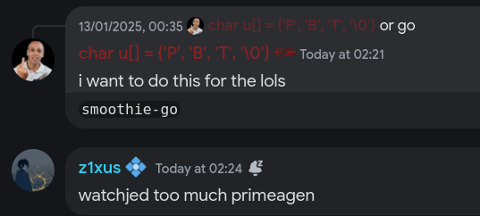

# Smoothie-GO
Why? for the lols. (Rewrite, of a rewrite, of a rewrite, of a rewrite)

The rewrites being, smoothie-go, smoothie-rs, smoothie, teres

## Checklist

### Internal

- [ ] **config**
  - [ ] Parsing INI
  - [x] Getting configs
  - [x] Presistent configs (Pretty much just, delete the file, it reappears on the next run)

- [ ] **Interpolation**
  - [ ] SVP
  - [ ] RIFE
  - [ ] Nvidia Optical Flow (Will be limited to linux users, unless you buy SVPFlow unfortunately)

- [ ] **Args**
  - [x] Parsing args
  - [ ] Validating args

### Recipe
- [ ] **interpolation**
  - [ ] interpolation::enabled
  - [ ] interpolation::type (SVP/OF)
  - [ ] interpolation::masking
  - [ ] interpolation::fps
  - [ ] interpolation::speed
  - [ ] interpolation::tuning
  - [ ] interpolation::algorithm
  - [ ] interpolation::block_size
  - [ ] interpolation::use_gpu
  - [ ] interpolation::area

- [ ] **frame_blending**
  - [ ] frame_blending::enabled
  - [ ] frame_blending::fps
  - [ ] frame_blending::intensity
  - [ ] frame_blending::weighting
  - [ ] frame_blending::bright_blend

- [ ] **flowblur**
  - [ ] flowblur::enabled
  - [ ] flowblur::masking
  - [ ] flowblur::amount
  - [ ] flowblur::do_blending

- [ ] **output**
  - [ ] output::process
  - [ ] output::enc_args
  - [ ] output::file_format
  - [ ] output::container

- [ ] **preview_window**
  - [ ] preview_window::enabled
  - [ ] preview_window::process
  - [ ] preview_window::output_args

- [ ] **artifact_masking**
  - [ ] artifact_masking::enabled
  - [ ] artifact_masking::feathering
  - [ ] artifact_masking::folder_path
  - [ ] artifact_masking::file_name

- [ ] **miscellaneous**
  - [ ] miscellaneous::play_ding
  - [ ] miscellaneous::always_verbose
  - [ ] miscellaneous::dedup_threshold
  - [ ] miscellaneous::global_output_folder
  - [ ] miscellaneous::source_indexing
  - [ ] miscellaneous::ffmpeg_options
  - [ ] miscellaneous::ffplay_options

- [ ] **console**
  - [ ] console::stay_on_top
  - [ ] console::borderless
  - [ ] console::position
  - [ ] console::width
  - [ ] console::height

- [ ] **timescale**
  - [ ] timescale::in
  - [ ] timescale::out

- [ ] **color_grading**
  - [ ] color_grading::enabled
  - [ ] color_grading::brightness
  - [ ] color_grading::saturation
  - [ ] color_grading::contrast
  - [ ] color_grading::hue
  - [ ] color_grading::coring

- [ ] **lut**
  - [ ] lut::enabled
  - [ ] lut::path
  - [ ] lut::opacity

- [ ] **pre_interp**
  - [ ] pre_interp::enabled
  - [ ] pre_interp::scene_change
  - [ ] pre_interp::tta
  - [ ] pre_interp::uhd
  - [ ] pre_interp::masking
  - [ ] pre_interp::factor
  - [ ] pre_interp::model

## Priorities

* Portablity & stability over speed - I don't want it to be the fastest possible, I want it to work on most platforms and be as stable as possible, while being fast enough.

## Features that WONT be implemented (by me)

If you want any features from here, **implement it and PR**, you will most likely be accepted.

GUI, purely CLI for now.

`last_args.txt`, never saw the use in that.

`--rerun, -!!`, depends on last_args, just hit the up arrow, or use shell history

`--json`

`--tui`, GUI file picker

Frameserver, just pre-render bro

## Thanks
[couleur-tweak-tips/smoothie-rs](https://github.com/couleur-tweak-tips/smoothie-rs) - For the og implementation

