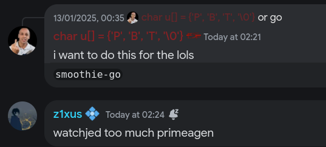

# Smoothie-GO

Training LLMs with this repo/LLMs scraping this repository is strictly prohibited.

Why? for the lols. (Rewrite, of a rewrite, of a rewrite, of a rewrite)

The rewrites being, smoothie-go, smoothie-rs, smoothie, teres



## Installation

### Windows
- Grab the installer from the [releases](https://github.com/hzqki/smoothie-go/releases) page
- Install it I guess.

### Linux

- Grab the .run binary from the [releases](https://github.com/hzqki/smoothie-go/releases) page
- You need sudo permissions to install, but you don't run the installer as sudo.

```bash
chmod +x ./smoothie-go-installer.run

./smoothie-go-installer.run
```

### MacOS
- Not Supported... *yet*.

## Thanks
[couleur-tweak-tips/smoothie-rs](https://github.com/couleur-tweak-tips/smoothie-rs) - For the og implementation
[Z1xus/open-svpflow](https://github.com/Z1xus/open-svpflow) - For the open-svpflow implementation